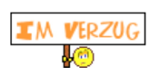

# Statusreport 13.05.2024

## Bericht

Wir konnten letzte Woche ein Widget zur Darstellung einer Linie im Viewer implementieren, allerdings treten noch einige Probleme auf: Die Linie wird entweder hinter dem Bild oder nicht an der korrekten Mausposition eingefügt, und die Distanzmessung scheint aufgrund dieser Positionierungsfehler unrealistisch. Positiv zu vermerken ist, dass die Rotation und Ausrichtung der Kamera erfolgreich umgesetzt wurden. Zudem haben wir kleinere Aufgaben wie den Austausch des Interaktors erfolgreich bearbeitet. Die aktuellen Probleme werden wir im morgigen Meeting als Gruppe besprechen und das weitere Vorgehen planen. Aufgrund bevorstehender Prüfungen einiger Teammitglieder könnten zeitliche Engpässe das Projekt jedoch verzögern.

### Projektstatus

Einige Tasks sind im Verzug, das Projekt ist
jedoch nicht gefährdet.

