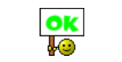

# Statusreport 27.05.2024

## Bericht

Wir sind kurz davor, das Feature zum Auslesen des Helligkeitswerts der Pixel abzuschliessen. Aktuell sind wir uns jedoch unsicher, wie und ob wir diese Werte normalisieren sollen und welchen Wert wir als maximalen (komplett weiss) verwenden sollen. Um diese Fragen zu klären, haben wir am Wochenende eine Anfrage per E-Mail an den Kunden gesendet. Sobald wir da eine Antwort haben, können wir diese Aufgabe rasch abschliessen. Das Line Widget funktioniert mittlerweile einwandfrei, und der zugehörige Button wurde erfolgreich in den Parent Component integriert. Ausserdem haben wir einige kleinere Anpassungen vorgenommen, wie das Laden eines einzelnen Slices und die Anpassung der Hintergrundfarbe. Vor der Übergabe des Projekts müssen wir noch das Code-Refactoring abschliessen. Obwohl nicht explizit gefordert, möchten wir zudem auch eine kurze Dokumentation erstellen, um die Übergabe und die zukünftige Weiterentwicklung zu erleichtern.

### Projektstatus

Das Projekt ist auf gutem Wege.

